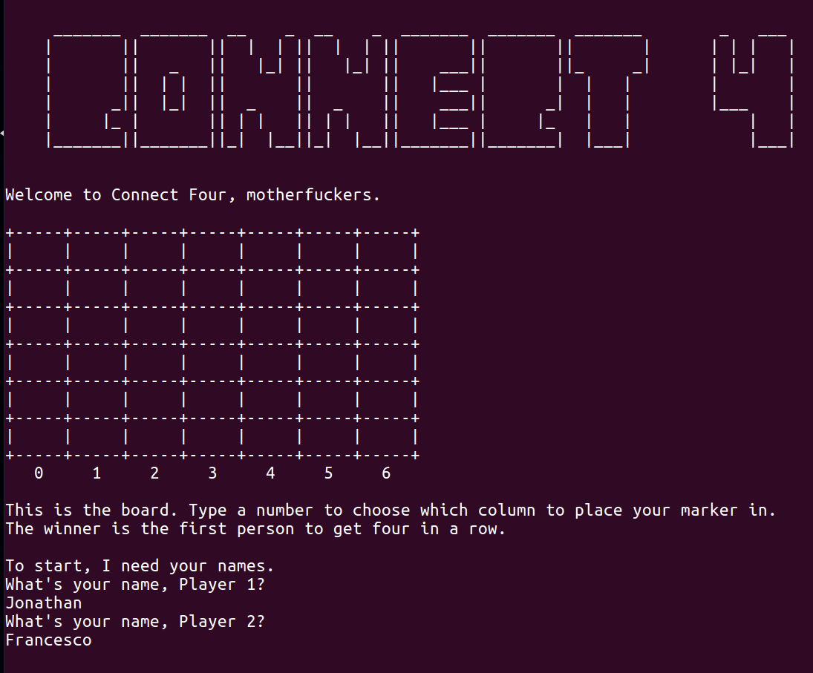
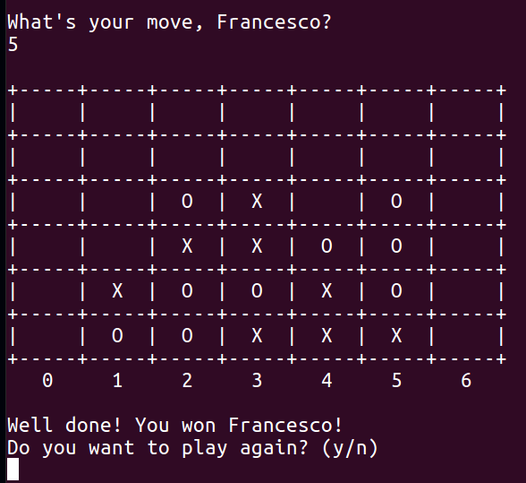

# Connect Four

This is a terminal game of Connect Four for two players, written in Ruby to practice TDD.

It's a project from [The Odin Project](https://www.theodinproject.com/courses/ruby-programming/lessons/testing-your-ruby-code).



## Installation

Open your terminal/command line. Navigate to the directory where you want this project to live. Type:
```
$ git clone https://github.com/Jonosenior/connect_four.git
$ cd connect_four
$ ruby connect_four.rb
```

## Game Structure
### Classes

  * **Board**: Stores & edits board status and checks for win conditions.
  * **Player**: Contains a player's name and marker ('X' or 'O').
  * **Announcer**: Prints all text to screen and handles interaction with the user.
  * **Cell**: Contains one of three values: empty, 'X' or 'O'.

  

## Thoughts

* I quickly realised that testing output would be beyond the scope of this project. At the beginning I tried to check that the program was printing correctly to the screen, but after doing some research it seems that it's complicated and unnecessary for this project. I did learn two extremely useful methods for managing I/O in tests:
    1.  To suppress any puts or print statements from appearing on the screen, use: allow_any_instance_of(IO).to receive(:puts).
    2. Use the #allow method to simply pass your chosen input to a #gets statement: allow(game).to receive(:gets).and_return("Jonathan").

* To be honest, I didn't enjoy my first experiment with pure TDD. I see the power of using tests to really ascertain that a method is doing what you expect it to do, and to force you to think beyond your expectations and systematically consider edge cases and so on. I also appreciated that testing first forces you as a designer to focus on outcomes, rather than architecture. But but but... in practice I found the stop-start workflow of constantly writing tests very annoying, and it prevented me from getting into a flow state. Moving backwards and forwards between testing and coding is necessary at some point, but especially at the beginning I found it slowed me down and made me work less efficiently. But hey - TDD is apparently on its way out anyway (replaced by BDD), and if not, I'll have more opportunities to get my head round it in the future.

* I worked hard on making this code a lot more modular than my previous projects - keeping the methods as short as possible, and stopped my previous practice of 'dovetailing' one method with another. I thought this was how a game was supposed to flow, but with advice from helpful people in The Odin Project Gitter, I realised that it made the methods extremely co-dependent, and impossible to test. For this project, my methods in each class do just one thing, and are woven together by the root 'Connect Four' file.

* Possible improvement: At the moment I iterate through every line on the board (every column, row and diagonal of at least 4 cells) at the end of every turn to check if the game is won. Instead, I could iterate only through those lines affected by the player's move. I decided against making this improvement right now because it would be too much work to implement considering the game analysis is lightning fast anyway, but on a much larger board it would be useful.


## Todo

  * Add a save game function with file serialisation using JSON.
